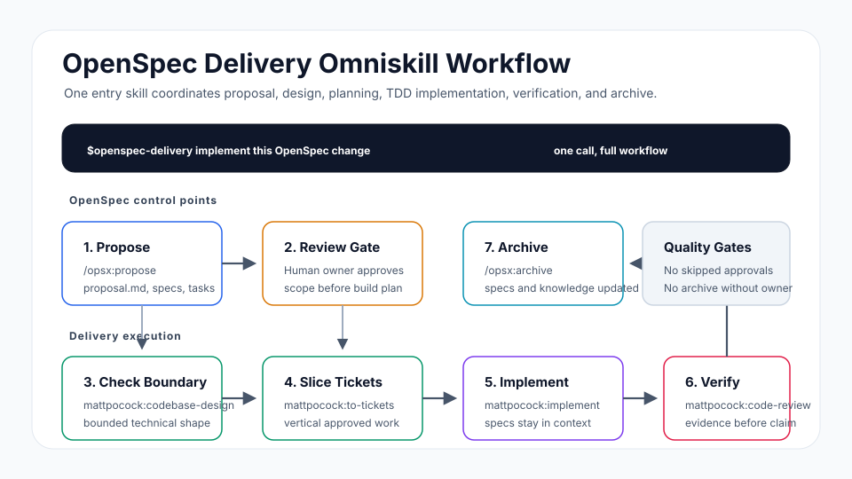

# OpenSpec Delivery Omniskills Workflow

Use `$openspec-delivery` to move one approved OpenSpec change through a short,
inspectable flow.

```text
Propose -> Approve -> Check boundary -> Tickets -> Implement -> Archive
```

OpenSpec owns the proposal and archive. Matt Pocock skills own codebase design,
vertical ticket slicing, TDD implementation, diagnosis, and review. The entry
skill invokes `mattpocock:implement` only when commit permission is explicit.



```bash
bun run dev -- validate examples/workflows/openspec-delivery
bun run dev -- deps examples/workflows/openspec-delivery
bun run dev -- install examples/workflows/openspec-delivery
```
